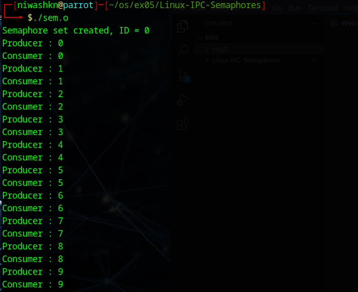
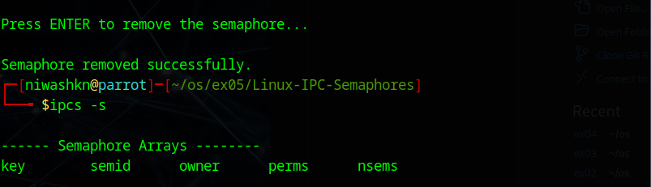

# Linux-IPC-Semaphores
Ex05-Linux IPC-Semaphores

# AIM:
To Write a C program that implements a producer-consumer system with two processes using Semaphores.

# DESIGN STEPS:

### Step 1:

Navigate to any Linux environment installed on the system or installed inside a virtual environment like virtual box/vmware or online linux JSLinux (https://bellard.org/jslinux/vm.html?url=alpine-x86.cfg&mem=192) or docker.

### Step 2:

Write the C Program using Linux Process API - Sempahores

### Step 3:

Execute the C Program for the desired output. 

# PROGRAM:

## Write a C program that implements a producer-consumer system with two processes using Semaphores.
~~~
/*
 * sem.c - Producer-Consumer using Semaphores
 */

#include <stdio.h>
#include <stdlib.h>
#include <unistd.h>
#include <sys/types.h>
#include <sys/ipc.h>
#include <sys/sem.h>
#include <sys/wait.h>

#define NUM_LOOPS 10

/* Define union semun */
union semun {
    int val;
    struct semid_ds *buf;
    unsigned short *array;
    struct seminfo *__buf;
};

/* Wait (P operation) */
void wait_semaphore(int sem_set_id)
{
    struct sembuf sem_op;

    sem_op.sem_num = 0;
    sem_op.sem_op = -1;
    sem_op.sem_flg = 0;

    semop(sem_set_id, &sem_op, 1);
}

/* Signal (V operation) */
void signal_semaphore(int sem_set_id)
{
    struct sembuf sem_op;

    sem_op.sem_num = 0;
    sem_op.sem_op = 1;
    sem_op.sem_flg = 0;

    semop(sem_set_id, &sem_op, 1);
}

int main()
{
    int sem_set_id;
    union semun sem_val;
    pid_t child_pid;

    /* Create semaphore */
    sem_set_id = semget(IPC_PRIVATE, 1, IPC_CREAT | 0600);

    if (sem_set_id == -1)
    {
        perror("semget");
        exit(EXIT_FAILURE);
    }

    printf("Semaphore set created, ID = %d\n", sem_set_id);

    /* Initialize semaphore to 0 */
    sem_val.val = 0;

    if (semctl(sem_set_id, 0, SETVAL, sem_val) == -1)
    {
        perror("semctl");
        exit(EXIT_FAILURE);
    }

    /* Create child process */
    child_pid = fork();

    if (child_pid < 0)
    {
        perror("fork");
        exit(EXIT_FAILURE);
    }

    if (child_pid == 0)
    {
        /* Consumer */
        for (int i = 0; i < NUM_LOOPS; i++)
        {
            wait_semaphore(sem_set_id);
            printf("Consumer : %d\n", i);
            fflush(stdout);
        }

        exit(EXIT_SUCCESS);
    }
    else
    {
        /* Producer */
        for (int i = 0; i < NUM_LOOPS; i++)
        {
            printf("Producer : %d\n", i);
            fflush(stdout);

            signal_semaphore(sem_set_id);

            usleep(500000);
        }

        wait(NULL);

        /* Pause so you can run 'ipcs -s' in another terminal */
        printf("\nPress ENTER to remove the semaphore...");
        getchar();

        /* Remove semaphore */
        semctl(sem_set_id, 0, IPC_RMID, sem_val);

        printf("\nSemaphore removed successfully.\n");
    }

    return 0;
}
~~~

## OUTPUT

$ ./sem.o 

$ ipcs

# RESULT:
The program is executed successfully.
